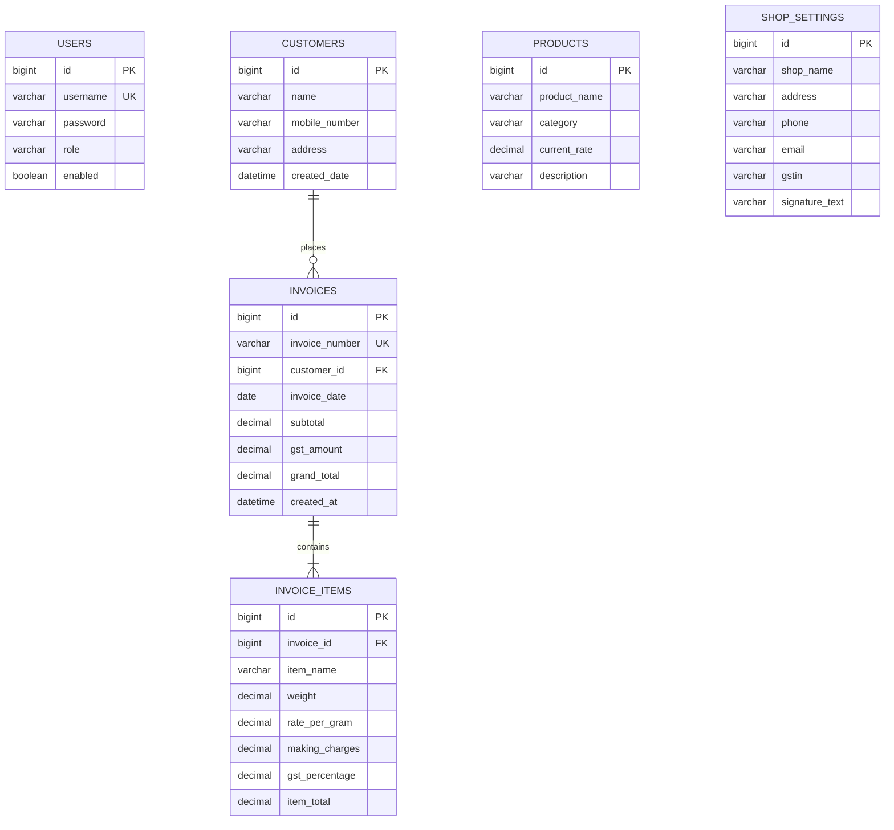

# Entity Relationship Diagram (ERD)

## Jewellery Shop Billing & Inventory Management System

## Relationships

| Relationship | Type | Description |
|-------------|------|-------------|
| Customer → Invoice | One-to-Many | A customer can have multiple invoices |
| Invoice → InvoiceItem | One-to-Many | An invoice contains multiple line items |
| User | Standalone | Admin authentication (no direct FK to other entities) |
| Product | Standalone | Inventory catalog (referenced by name in invoice items) |
| ShopSettings | Standalone | Shop details for PDF invoices |

## Cardinality

- **1 Customer : N Invoices** — Each invoice belongs to exactly one customer
- **1 Invoice : N InvoiceItems** — Each item belongs to exactly one invoice
- **Cascade**: Deleting an invoice deletes its items (orphanRemoval)
